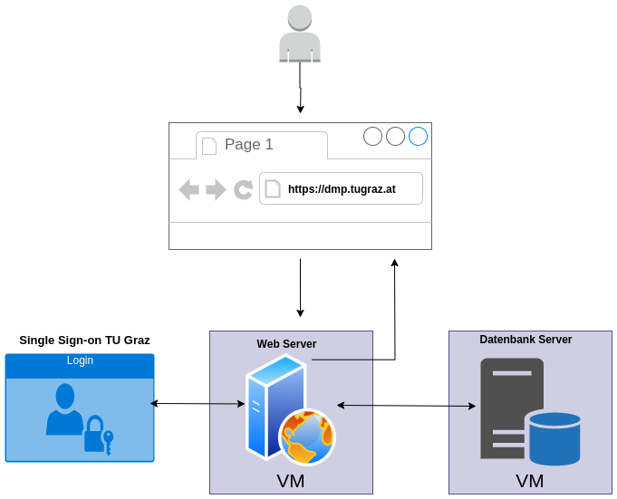
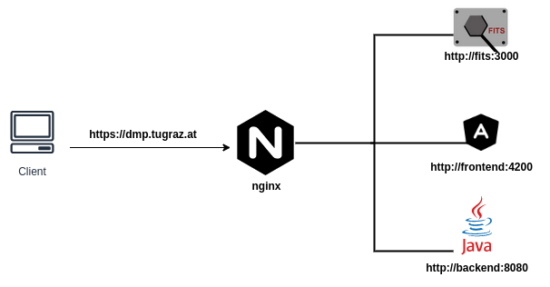

# DMP

Documentation for Data Management Plan(DMP) tool at TU Graz.

## Diagram

  

----

  

## [POSTGRESQL](postgresql/README.md)
Installing and configuration of PostgreSQL database for this project.

## [GITLAB-RUNNER](gitlab-runner/README.md)
Installing and configuring group runner for this project.

## [EXTRA](extra/README.md)
Installing and configuring extra required packages on the hosts.

## [BACKEND](backend/README.md)
Installing and configuring backend for this project.
