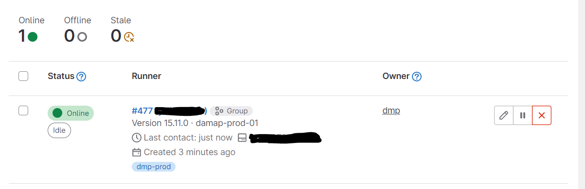

# gitlab-runner

## install

```bash
# access the host
ssh -i dmptool dmpadm@dmptool.tugraz.at 

# install gitlab-runner
# PS. needs to be a root user
sudo curl -L --output /usr/local/bin/gitlab-runner "https://gitlab-runner-downloads.s3.amazonaws.com/latest/binaries/gitlab-runner-linux-amd64"

# Give it permissions to execute:
sudo chmod +x /usr/local/bin/gitlab-runner

# Create a GitLab CI user:
sudo useradd --comment 'GitLab Runner' --create-home gitlab-runner --shell /bin/bash

# install gitlab runner
sudo gitlab-runner install --user=gitlab-runner --working-directory=/home/gitlab-runner

# Install and run as service:
sudo gitlab-runner start

# check the status
systemctl status gitlab-runner
```

## register

`sudo gitlab-runner register`

```shell                         
Enter the GitLab instance URL (for example, https://gitlab.com/):
https://gitlab.tugraz.at/
Enter the registration token:
**************************
Enter a description for the runner:
[damap-prod-01]: dmp-prod
Enter tags for the runner (comma-separated):
prod
Enter optional maintenance note for the runner:

Registering runner... succeeded                     runner=********
Enter an executor: ssh, docker+machine, kubernetes, docker, shell, parallels, virtualbox, docker-ssh+machine, custom, docker-ssh:
shell
```

## add gitlab-runner user to the group

```bash
sudo usermod -aG docker gitlab-runner
```

## Check available runners

<div style="text-align:center">
  
</div>


## Possible Errors
These error might apear when using this registered runner for the first time.

### The runner throws an ERROR

```bash
ERROR: Job failed (system failure): prepare environment: exit status 1
[SEE HERE](https://docs.gitlab.com/runner/shells/index.html#shell-profile-loading).
```

**Solution**
Remove/comment ```.bash_logout``` entries.

- Access your VM server

- Navigate to ```/home/gitlab-runner```

- Look for file called ```.bash_logout```

- Remove or comment the entries on this file


#### error "Error saving credentials"

```bash
Error saving credentials: error storing credentials - err: exit status 1, out: `Cannot autolaunch D-Bus without X11 $DISPLAY
```

**Solution:** install package in VM

```apt install gnupg2 pass```.


To learn more Gitlab-runner commands, visit
the [GitLab Runner commands](https://docs.gitlab.com/runner/commands/).
